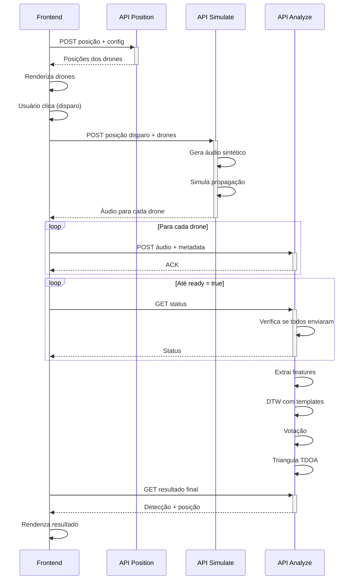

# Documentação das APIs

## Visão Geral

O simulador possui 3 APIs principais:

1. **Drone Position API** - Calcula posições dos drones
2. **Audio Simulate API** - Simula disparo e captura
3. **Audio Analyze API** - Detecta e triangula

---

## 1. Drone Position API

**Endpoint**: `POST /api/drone/position`

Calcula posições aleatórias dos drones dentro de um raio sem sobreposição.

### Request Body

```json
{
  "position": [longitude, latitude],  // Centro da área (WGS84)
  "drone_count": 5,                    // Quantidade de drones
  "radius": 0.3                        // Raio em km
}
```

### Response

```json
{
  "x": [lon1, lon2, lon3, ...],       // Longitudes dos drones
  "y": [lat1, lat2, lat3, ...],       // Latitudes dos drones
  "center": {
    "lon": -43.1234,
    "lat": -22.5678
  },
  "radius": 300                        // Raio em metros
}
```

### Exemplo

```javascript
const response = await fetch('/api/drone/position', {
  method: 'POST',
  headers: { 'Content-Type': 'application/json' },
  body: JSON.stringify({
    position: [-43.2096, -22.9035],  // Rio de Janeiro
    drone_count: 5,
    radius: 0.3
  })
});

const data = await response.json();
// data.x = [-43.2100, -43.2092, ...]
// data.y = [-22.9040, -22.9030, ...]
```

### Algoritmo

- Usa Poisson Disk Sampling simplificado
- Distância mínima entre drones: 30m (hardcoded)
- Máximo 1000 tentativas por drone
- Distribuição uniforme dentro do círculo (usando sqrt para correção)

---

## 2. Audio Simulate API

**Endpoint**: `POST /api/audio/simulate`

Simula um disparo e gera áudio capturado por cada drone.

### Request Body

```json
{
  "gunshotPosition": {
    "lon": -43.2100,
    "lat": -22.9040
  },
  "dronePositions": [
    {
      "droneId": "drone-0",
      "position": { "lon": -43.2105, "lat": -22.9045 }
    },
    {
      "droneId": "drone-1",
      "position": { "lon": -43.2095, "lat": -22.9035 }
    }
    // ... mais drones
  ]
}
```

### Response

```json
{
  "success": true,
  "gunshotPosition": {
    "lon": -43.2100,
    "lat": -22.9040
  },
  "droneAudioData": [
    {
      "droneId": "drone-0",
      "audioData": "base64EncodedFloat32Array...",
      "distance": 125.5,              // Distância em metros
      "position": { "lon": ..., "lat": ... }
    }
    // ... um para cada drone
  ],
  "message": "Gunshot simulated successfully"
}
```

### Características do Áudio Simulado

- **Taxa de amostragem**: 44100 Hz
- **Duração**: ~0.5 segundos
- **Formato**: Float32Array (32-bit float, -1.0 a 1.0)
- **Codificação**: Base64

### Efeitos Aplicados

1. **Delay temporal**: `delay = distância / 343` segundos
2. **Atenuação**: `amplitude = 1 / (1 + distância/100)`
3. **Ruído**: Gaussiano com σ = 0.05

### Forma de Onda do Disparo

```
Amplitude
1.0 |     *
    |    / \
    |   /   \___
0.5 |  /        \____
    | /              \______
0.0 |/____________________\_______
    0   10ms  50ms  100ms    500ms
```

- **Attack**: 0-10ms (subida rápida)
- **Decay**: 10ms-500ms (decaimento exponencial)
- **Frequências**: Ruído branco + componente 100Hz

---

## 3. Audio Analyze API

**Endpoint**: 
- `POST /api/audio/analyze` - Submete áudio
- `GET /api/audio/analyze` - Obtém resultado

### POST: Submeter Áudio

```json
{
  "sessionId": "session-1234567890",
  "droneId": "drone-0",
  "audioData": "base64EncodedFloat32Array...",
  "position": { "lon": -43.2100, "lat": -22.9040 },
  "timestamp": 1699999999999
}
```

**Response:**

```json
{
  "success": true,
  "droneId": "drone-0",
  "message": "Audio data received",
  "dronesReceived": 3
}
```

### GET: Obter Resultado

**Query Params:**
- `sessionId`: ID da sessão
- `expectedDrones`: Quantidade esperada de drones

**URL Example:**
```
/api/audio/analyze?sessionId=session-1234567890&expectedDrones=5
```

**Response (ainda aguardando):**

```json
{
  "ready": false,
  "dronesReceived": 3,
  "expectedDrones": 5
}
```

**Response (análise completa):**

```json
{
  "ready": true,
  "isGunshot": true,
  "confidence": 0.87,
  "gunshotDetections": 4,
  "totalDrones": 5,
  "decisionMethod": "weighted_by_distance",  // ou "simple_majority" ou "simple_majority_fallback"
  "weightedScore": 0.92,                     // presente apenas quando votação ponderada é usada
  "detectionRate": 0.8,                      // 4/5 = 80%
  "calculatedPosition": {
    "lon": -43.2101,
    "lat": -22.9041
  },
  "classifications": [
    {
      "droneId": "drone-0",
      "isGunshot": true,
      "confidence": 0.92
    },
    {
      "droneId": "drone-1",
      "isGunshot": true,
      "confidence": 0.85
    }
    // ... um para cada drone
  ]
}
```

### Algoritmo de Análise

1. **Extração de Features**
   - Energia por frame (janela 2048 samples, hop 512)
   - Zero-crossing rate
   - Normalização 0-1

2. **DTW (Dynamic Time Warping)**
   - Compara features com templates de disparos
   - Compara features com templates de ambiente
   - Distância normalizada pelo comprimento

3. **Classificação**
   - Se `distance_gunshot < distance_ambient` → provável disparo
   - Se `distance_gunshot < threshold` → confirma disparo
   - Threshold padrão: 0.3

4. **Votação**
   - **Votação Simples** (quando < 5% dos drones detectam disparo):
     - Maioria simples: ≥ 50% dos drones
     - Exemplo: 3 de 5 drones = disparo confirmado
   
   - **Votação Ponderada por Distância** (quando ≥ 5% detectam disparo):
     - Ativada automaticamente quando taxa de detecção ≥ 5%
     - Triangulação preliminar calcula posição estimada
     - Peso por drone: `e^(-0.1 × distância_metros)`
     - Score ponderado: soma das confianças × pesos / soma dos pesos
     - Disparo confirmado se score normalizado > 0.5
     - Drones mais próximos têm influência exponencialmente maior
     - Exemplo de pesos:
       - Drone a 0m: peso = 1.00 (100%)
       - Drone a 100m: peso = 0.37 (37%)
       - Drone a 500m: peso = 0.007 (0.7%)

5. **Triangulação (TDOA)**
   - Ordena drones por tempo de chegada
   - Usa primeiro drone como referência
   - Calcula weighted centroid
   - Peso inversamente proporcional ao delay

---

## Tipos de Dados

### GeoPosition

```typescript
interface GeoPosition {
  lon: number;  // Longitude WGS84
  lat: number;  // Latitude WGS84
}
```

### DronePosition

```typescript
interface DronePosition {
  lon: number;
  lat: number;
  droneId: string;
}
```

### AudioFeatures

```typescript
interface AudioFeatures {
  energy: number[];            // Energia por frame
  zeroCrossingRate: number[];  // ZCR por frame
  mfcc?: number[];             // Opcional: MFCC
  spectralCentroid?: number[]; // Opcional: Centróide espectral
}
```

### DroneAudioData (interno)

```typescript
interface DroneAudioData {
  droneId: string;
  position: GeoPosition;
  audioFeatures: number[];
  timestamp: number;
  timeOfArrival: number;  // Em segundos
}
```

---

## Constantes Importantes

### Física

```javascript
const SPEED_OF_SOUND = 343;     // m/s (a 20°C)
const EARTH_RADIUS = 6378137;   // metros
```

### Áudio

```javascript
const SAMPLE_RATE = 44100;      // Hz
const FRAME_SIZE = 2048;        // samples
const HOP_SIZE = 512;           // samples
```

### Detecção

```javascript
const DTW_THRESHOLD = 0.3;      // Limiar de similaridade
const MIN_DRONE_DISTANCE = 30;  // metros
const NOISE_LEVEL = 0.05;       // Amplitude do ruído
```

### Sincronização

```javascript
const SYNC_TIMEOUT_MS = 5000;   // Timeout para receber todos os drones
```

---

## Códigos de Erro

### 400 Bad Request

```json
{
  "error": "Invalid position, drone count, or radius"
}
```

Causa: Parâmetros inválidos ou ausentes

### 500 Internal Server Error

```json
{
  "error": "Failed to process audio"
}
```

Causa: Erro no processamento interno

---

## Fluxo Completo de Detecção


```mermaid
sequenceDiagram
    Frontend->>+API Position: POST posição + config
    API Position-->>-Frontend: Posições dos drones
    
    Frontend->>Frontend: Renderiza drones
    Frontend->>Frontend: Usuário clica (disparo)
    
    Frontend->>+API Simulate: POST posição disparo + drones
    API Simulate->>API Simulate: Gera áudio sintético
    API Simulate->>API Simulate: Simula propagação
    API Simulate-->>-Frontend: Áudio para cada drone
    
    loop Para cada drone
        Frontend->>+API Analyze: POST áudio + metadata
        API Analyze-->>-Frontend: ACK
    end
    
    loop Até ready = true
        Frontend->>+API Analyze: GET status
        API Analyze->>API Analyze: Verifica se todos enviaram
        API Analyze-->>-Frontend: Status
    end
    
    API Analyze->>API Analyze: Extrai features
    API Analyze->>API Analyze: DTW com templates
    API Analyze->>API Analyze: Votação
    API Analyze->>API Analyze: Triangula TDOA
    
    Frontend->>+API Analyze: GET resultado final
    API Analyze-->>-Frontend: Detecção + posição
    
    Frontend->>Frontend: Renderiza resultado
```

---

## Exemplos de Uso Completo

### Cenário: Testar Sistema com 5 Drones

```javascript
// 1. Posicionar drones
const centerPos = [-43.2096, -22.9035]; // Rio
const posResponse = await fetch('/api/drone/position', {
  method: 'POST',
  headers: { 'Content-Type': 'application/json' },
  body: JSON.stringify({
    position: centerPos,
    drone_count: 5,
    radius: 0.3
  })
});
const { x, y } = await posResponse.json();

const dronePositions = x.map((lon, i) => ({
  droneId: `drone-${i}`,
  position: { lon, lat: y[i] }
}));

// 2. Simular disparo
const shotPos = { lon: -43.2100, lat: -22.9040 };
const simResponse = await fetch('/api/audio/simulate', {
  method: 'POST',
  headers: { 'Content-Type': 'application/json' },
  body: JSON.stringify({
    gunshotPosition: shotPos,
    dronePositions
  })
});
const { droneAudioData } = await simResponse.json();

// 3. Enviar áudio de cada drone
const sessionId = `session-${Date.now()}`;
for (const droneAudio of droneAudioData) {
  await fetch('/api/audio/analyze', {
    method: 'POST',
    headers: { 'Content-Type': 'application/json' },
    body: JSON.stringify({
      sessionId,
      droneId: droneAudio.droneId,
      audioData: droneAudio.audioData,
      position: droneAudio.position,
      timestamp: Date.now()
    })
  });
}

// 4. Aguardar análise
let result;
while (true) {
  await new Promise(r => setTimeout(r, 500));
  const r = await fetch(
    `/api/audio/analyze?sessionId=${sessionId}&expectedDrones=5`
  );
  result = await r.json();
  if (result.ready) break;
}

// 5. Resultado
console.log('Disparo detectado?', result.isGunshot);
console.log('Posição calculada:', result.calculatedPosition);
console.log('Posição real:', shotPos);
```

---

## Performance

### Tempos Esperados

- **Cálculo de posições**: < 50ms
- **Simulação de áudio**: ~100ms (5 drones)
- **Análise DTW**: ~200ms por drone
- **Triangulação**: < 10ms
- **Total (5 drones)**: ~1-2 segundos

### Escalabilidade

- **Máximo de drones testado**: 20
- **Máximo recomendado**: 15
- **Mínimo funcional**: 3

---

## Troubleshooting

### "Audio data not ready"

- Aguarde mais tempo
- Verifique se todos os drones enviaram dados
- Verifique sessionId

### "Position not calculated"

- Menos de 3 drones
- Áudio muito fraco
- Não detectado como disparo

### Posição calculada imprecisa

- Normal em simulação
- Melhora com mais drones
- Melhora quando disparo está no centro

---

**Fim da documentação das APIs** 🎯
